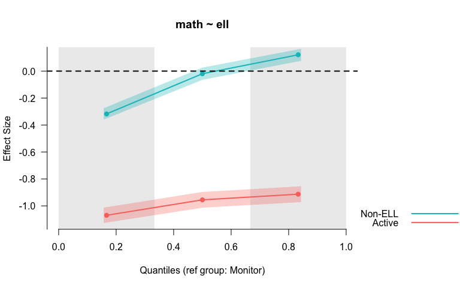
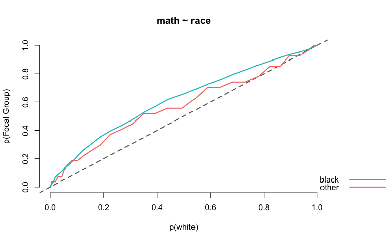
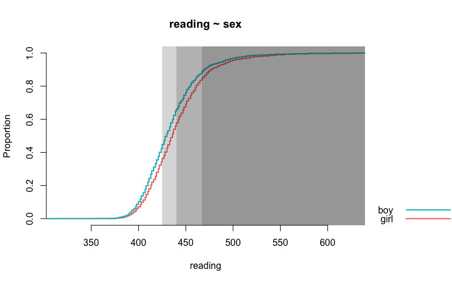

<!-- README.md is generated from README.Rmd. Please edit that file -->
esvis
=====

R Package for effect size visualizations.

[](https://travis-ci.org/DJAnderson07/esvis) [](https://ci.appveyor.com/project/DJAnderson07/esvis) [](https://codecov.io/gh/DJAnderson07/esvis)

This package is designed to visually compare two or more distributions across the entirety of the scale, rather than only by measures of central tendency (e.g., means). There are also some functions for estimating effect size, including Cohen's *d*, Hedges' *g*, percentage above a cut, transformed (normalized) percentage above a cut, the area under the curve (conceptually equivalent to the probability that a randomly selected individual from Distribution A has a higher value than a randomly selected individual from Distribution B), and the *V* statistic, which essentailly transforms the area under the curve to standard deviation units (see [Ho, 2009](https://www.jstor.org/stable/40263526?seq=1#page_scan_tab_contents)).

Installation
------------

You can install *esvis* from github with:

``` r
# install.packages("devtools")
devtools::install_github("DJAnderson07/esvis")
```

Plotting methods
----------------

There are three primary data visualizations: (a) binned effect size plots, (b)probability-probability plots, and (c) empirical cumulative distribution functions. All plots should be fully manipulable with calls to the base plotting functions.

At present, the binned effect size plot can only be produced with Cohen's *d*, although future development will allow the user to select the type of effect size. The binned effect size plot splits the distribution into quantiles specified by the user (defaults to lower, middle, and upper thirds), calculates the mean difference between groups within each quantile bin, and produces an effect size for each bin by dividing by the overall pooled standard deviation (i.e., not by quantile). For example

``` r
library(esvis)
binned_plot(math ~ condition, star)
```



Both the reference group and the quantiles used can be changed. For example `binned_plot(math ~ condition, star, ref_group = "reg", qtiles = seq(0, 1, .2))` would produce the same plot but binned by quintiles, with regular-sized classrooms serving as the reference group.

A probability-probability plot can be produced with a call to `pp_plot` and an equivalent argument structure. In this case, we're visualizing the difference in math achievement by race. Notice the "other" category is jagged because the sample size is small (*n* = 27).

``` r
pp_plot(math ~ race, star)
```



Finally, the `ecdf_plot` function essentially dresses up the base `plot.ecdf` function, but also adds some nice referencing features through additional, optional arguments.

``` r
ecdf_plot(reading ~ sex, star, ref_cut = c(425, 440, 467))
```



Estimation Methods
------------------

Compute effect sizes for all possible pairwise comparisons.

``` r
coh_d(mean ~ subject, seda)
#>   ref_group foc_group   estimate
#> 1      math       ela  0.8312519
#> 2       ela      math -0.8312519
```

Or specify a reference group

``` r
coh_d(mean ~ grade, seda, ref_group = 8)
#>   ref_group foc_group estimate
#> 1         8         7 0.593485
#> 2         8         6 1.165106
#> 3         8         5 1.819459
#> 4         8         4 2.416754
#> 5         8         3 3.004039
```
